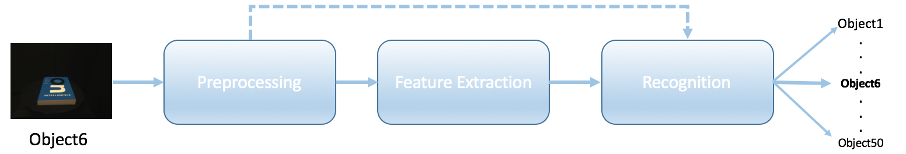
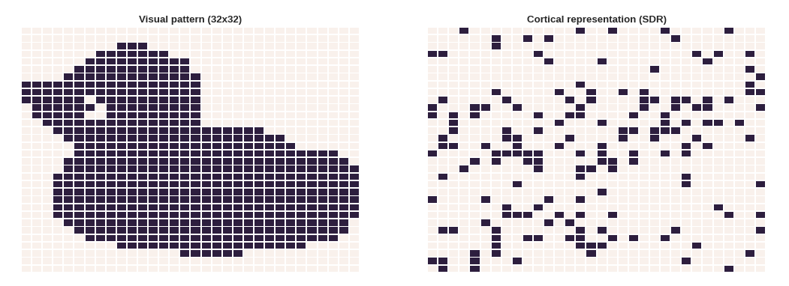

# ESAAN 2017 
This repository consists of the data - including scripts, folders, and images- to reproduce the results of the submitted paper to ESAAN 2017.  

> **Abstract:** This paper reports our work on object recognition by using the spatial pooler of Hierarchical Temporal Memory (HTM) as a method for feature selection. To perform recognition task, we employed this phase to select features from COIL-100 dataset. We benchmarked the results with the state-of-the-art feature extraction methods while using the different amounts of training data (from 5% to 45%). The results indicate that the performed method is effective for object recognition with a low amount of training data in which the hand-engineered state-of-the-art feature extraction methods show limitations.  

## Folders and content descriptions
* **COIL100:** Downsized (32x32) images from the Columbia University Image Library (COIL-100) dataset [1].
* **DATA:** Various data folders saved during pipeline implementation.  
	* **pixel:** Unprocessed pixel vector for each image. 
	* **hog:**   Histogram oriented gradients. 
	* **nhistogram:** Normalized 3D Color Histograms 
	* **CAs**:   Cortical Activation Vectors 
* **Figures:** Sample images from the COIL-100, data flow diagram for Spatial Pooler confusion matrices and accuracy curves.  
* **Recognition pipeline:**
This folder contains recognition pipeline phases: preprocessing, feature extraction and recognition algorithms. More information on these phases and their implementation steps can be found in Methdods Section of the submitted paper. The figure below illustrates the data-flow of the pipeline. In that, the raw image pixels preprocessed to be the inputs of either feature extraction or recognition phase. By doing so, we aimed to benchmark the recognition results with different features and different amount of training data.  

  

*  **Spatial pooler:**  This folder contains the framework used for feature extraction phase of the implemented pipeline. The framework adapted and modified based on following studies [2][3]. A visual pattern and the generated cortical representation of it are shown in the figure below.  

## References
[1] Sameer A. Nene, Shree K. Nayar, and Hiroshi Murase. Object image library (coil-100). Technical report, 1996.  
[2] Hawkins, J., Ahmad, S., and Dubinsky, D. (2011). [Hierarchical Temporal Memory Including htm Cortical Learning Algorithms.](http://numenta.org/resources/HTM_CorticalLearningAlgorithms.pdf)  
[3] Mnatzaganian J, Fokoué E and Kudithipudi D (2017) A Mathematical Formalization of Hierarchical Temporal Memory’s Spatial Pooler. Front. Robot. AI 3:81. [doi: 10.3389/frobt.2016.00081](http://10.3389/frobt.2016.00081) 
